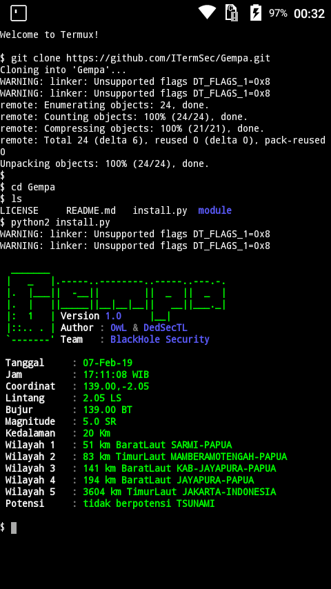

# Gempa
Gempa data from BMKG Indonesia. Tanpa pip install request karena agar pengguna Terminal Emulator android bisa merasakan script yang bisa di gunakan oleh Termux.
# Install
'''bash
$ pkg install python2
$ apt install git
$ git clone https://github.com/ITermSec/Gempa.git
$ cd Gempa
$ python2 install.py
'''
# Screenshot

